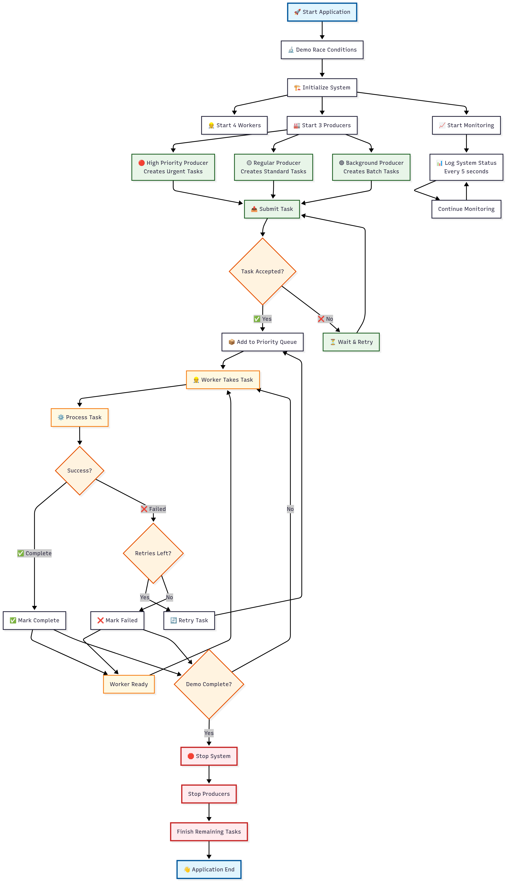

# ConcurQueue - Concurrent Task Dispatch System

A multithreaded job processing platform demonstrating Java concurrency best practices using MVC architecture.

## 🚀 Quick Start

### Prerequisites
- Java 11 or higher
- No external dependencies required

### Running the Application

1. **Clone/Download the project**
2. **Compile all Java files:**
   ```bash
   javac -d . src/**/*.java
   ```
3. **Run the application:**
   ```bash
   java ConcurQueueApplication
   ```
## activity diagram
 

## 📁 Project Structure

```
src/
├── model/          # Data entities and business logic
├── view/           # Console display and formatting
├── controller/     # Application flow control
├── producer/       # Task generators
├── util/           # Logging and utilities
└── demo/           # Concurrency demonstrations
```

## 🎯 What It Does

The system simulates a real-world task processing platform where:

- **Multiple Producers** generate different types of tasks:
    - **High Priority**: Critical/urgent tasks (Priority 8-10)
    - **Regular**: Standard business tasks (Priority 4-7)
    - **Background**: Batch processing tasks (Priority 1-3)

- **Worker Pool** processes tasks concurrently using thread-safe mechanisms

- **Priority Queue** ensures high-priority tasks are processed first

- **Monitoring System** tracks performance and displays real-time metrics

## 🖥️ Expected Output

### Race Condition Demo
```
🔬 RACE CONDITION DEMONSTRATION
==================================
❌ Unsafe Counter:        4,847 (Expected: 5,000) - ❌ RACE CONDITION!
✅ Atomic Counter:        5,000 (Expected: 5,000) - ✅ CORRECT
✅ Synchronized Counter:  5,000 (Expected: 5,000) - ✅ CORRECT
```

### Live Task Processing
```
📤 [HighPriority-Producer] Submitted HighPriority-Producer-URGENT-1
⚙️  [Worker-1] Processing HighPriority-Producer-URGENT-1
✅ [Worker-1] Completed HighPriority-Producer-URGENT-1 in 1100ms
```

### System Monitoring (Every 5 seconds)
```
═══ SYSTEM STATUS [2025-06-22 10:30:20] ═══
📊 Current State:
   • Queue Size: 8 tasks
   • Active Workers: 4
   • Tasks In Progress: 3

📈 Throughput:
   • Tasks Submitted: 45
   • Tasks Completed: 38
   • Tasks Failed: 2
   • Completion Rate: 84.4%
```

## 🎓 Learning Objectives

This project demonstrates:

- **Java Memory Model** and thread safety
- **Producer-Consumer** patterns with blocking queues
- **Thread Pool** management and lifecycle
- **Priority-based** task scheduling
- **Synchronization** techniques (synchronized, atomic, concurrent collections)
- **Error handling** and retry mechanisms
- **Graceful shutdown** procedures
- **MVC Architecture** for maintainable code
- **Comprehensive logging** strategies

## 🔧 Configuration

Key settings in `ConcurQueueApplication.java`:

```java
private static final int WORKER_THREADS = 4;        // Number of worker threads
private static final int MAX_RETRIES = 3;           // Task retry attempts
private static final int DEMO_DURATION_SECONDS = 60; // How long to run
```

## 📝 Generated Files

The application creates log files in the `logs/` directory:
- `application.log` - General application events
- `taskcontroller.log` - Task processing details
- `systemcontroller.log` - System operations
- `*.log` - Component-specific logs

## 🏆 Key Features

- ✅ **Thread-Safe**: Uses concurrent collections and atomic operations
- ✅ **Priority Handling**: High-priority tasks processed first
- ✅ **Fault Tolerant**: Failed tasks are automatically retried
- ✅ **Observable**: Real-time monitoring and comprehensive logging
- ✅ **Graceful Shutdown**: Clean resource cleanup
- ✅ **Production-Ready**: Error handling and resource management

## 🎯 Perfect For

- Learning Java concurrency concepts
- Understanding producer-consumer patterns
- Demonstrating thread safety techniques
- Portfolio projects for job interviews
- Understanding MVC architecture in practice

---

**Duration:** ~1 minute runtime  
**Output:** Console logs + log files  
**Educational Value:** Comprehensive concurrency demonstration